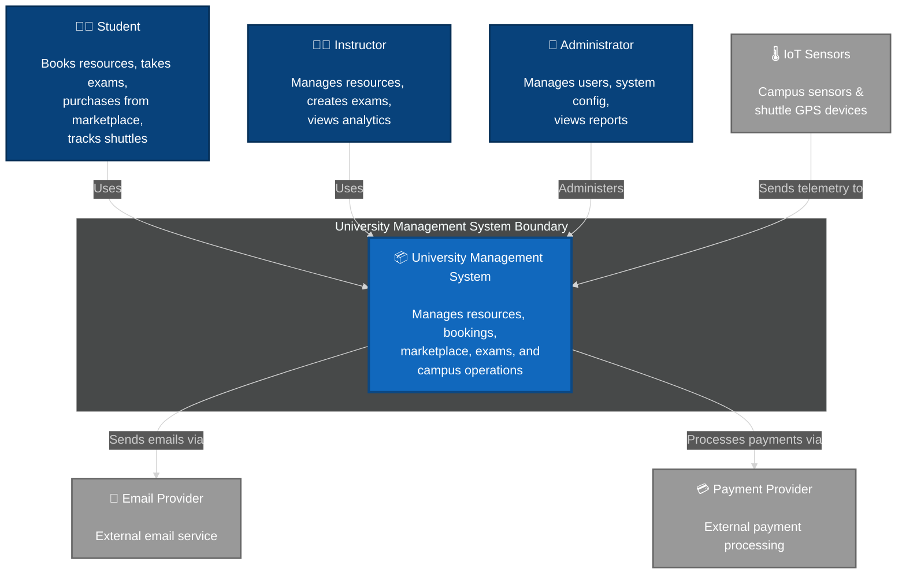
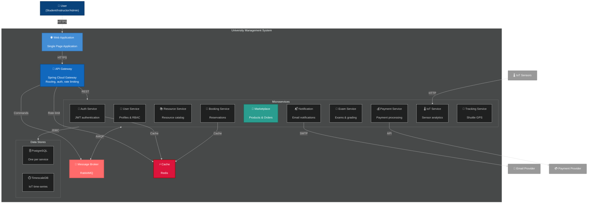
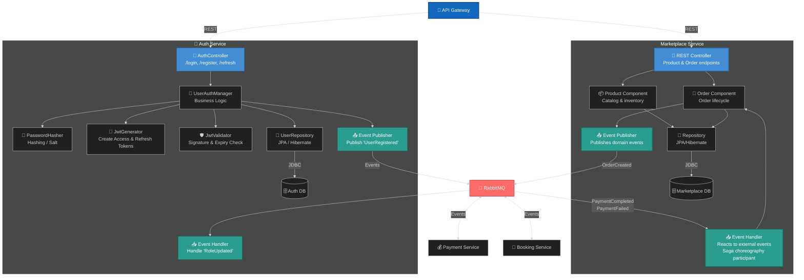
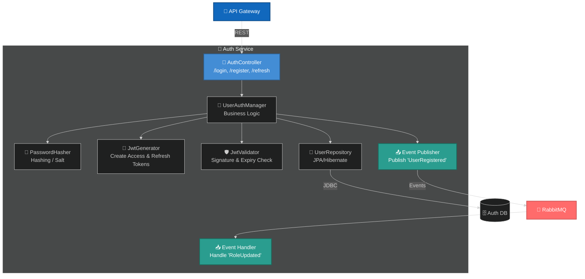
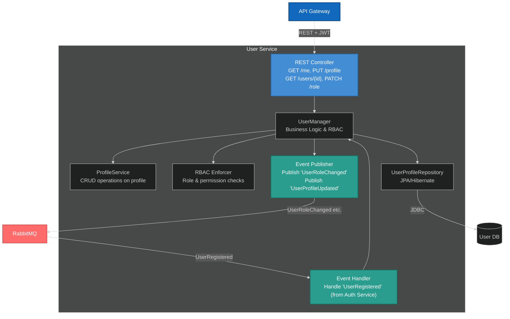
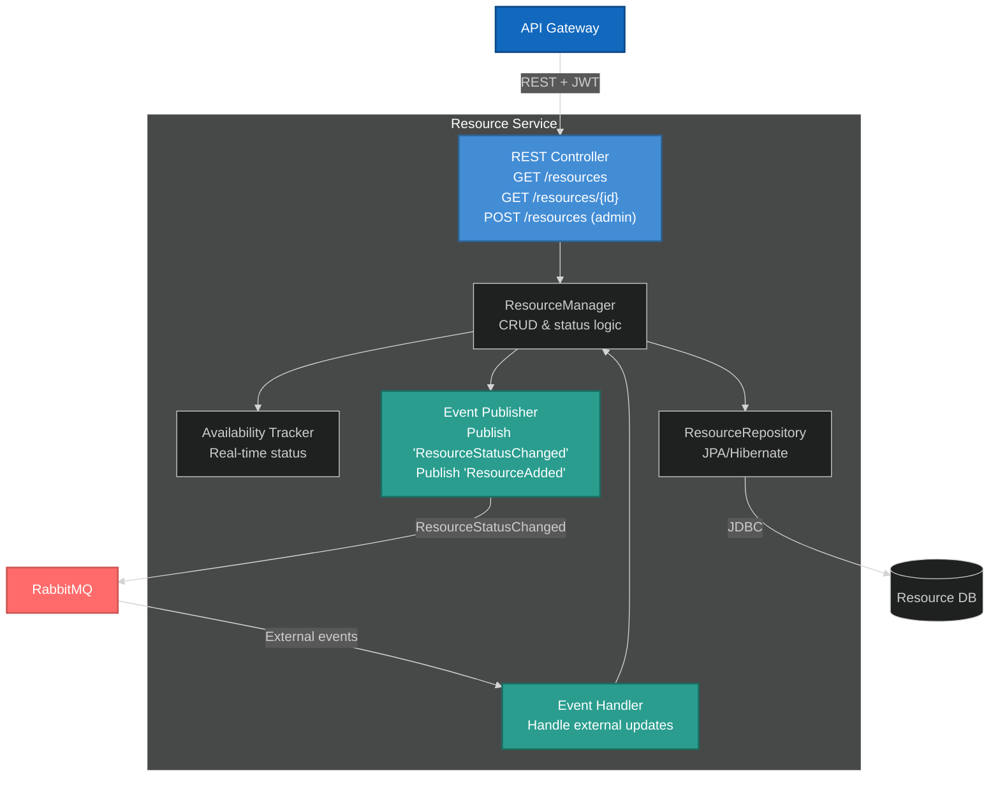
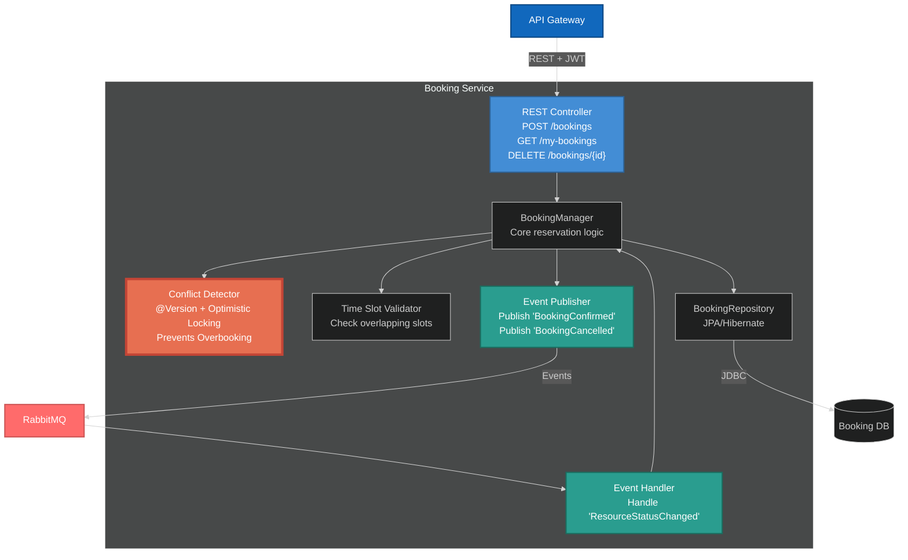

# University Management System

A loosely coupled, event-driven microservices architecture implementing the Saga pattern (Choreography) for distributed transactions.

## Architecture Overview

### Core Principles
- **Database per Service**: Each microservice owns its dedicated PostgreSQL instance for true data isolation
- **Event-Driven**: Services communicate through domain events, enabling loose coupling
- **CQRS**: Queries via REST, Commands via message broker

### Communication Patterns
| Pattern | Technology | Usage |
|---------|------------|-------|
| API Gateway | Spring Cloud Gateway | Single entry point, routing, JWT validation, rate limiting |
| Synchronous | HTTP/REST | Queries only (CQRS read side) |
| Asynchronous | RabbitMQ | Commands, events, inter-service communication |
| Caching | Redis | Sessions, JWT blacklist, rate limiting |

### Authentication & Security
- JWT authentication via Auth Service
- JWT validation at API Gateway (per request)
- RBAC enforcement per operation
- Audit logging for sensitive operations

### Failure Handling
- **Circuit Breakers**: Resilience4j for fault tolerance
- **Retry Logic**: Exponential backoff for transient failures
- **Dead Letter Queues**: Failed messages routed to DLQ for inspection and replay

---

## C4 Architecture Diagrams

### Level 1: System Context

Shows the system boundary and external actors/systems.


```mermaid
---
config:
  theme: dark
---
flowchart TB
    subgraph boundary [University Management System Boundary]
        System["📦 University Management System<br/><br/>Manages resources, bookings,<br/>marketplace, exams, and<br/>campus operations"]
    end

    Student["👨‍🎓 Student<br/><br/>Books resources, takes exams,<br/>purchases from marketplace,<br/>tracks shuttles"]
    
    Instructor["👩‍🏫 Instructor<br/><br/>Manages resources, creates exams,<br/>views analytics"]
    
    Admin["👤 Administrator<br/><br/>Manages users, system config,<br/>views reports"]

    EmailSystem["📧 Email Provider<br/><br/>External email service"]
    
    PaymentProvider["💳 Payment Provider<br/><br/>External payment processing"]

    IoTSensors["🌡️ IoT Sensors<br/><br/>Campus sensors &<br/>shuttle GPS devices"]

    Student -->|"Uses"| System
    Instructor -->|"Uses"| System
    Admin -->|"Administers"| System
    
    System -->|"Sends emails via"| EmailSystem
    System -->|"Processes payments via"| PaymentProvider
    IoTSensors -->|"Sends telemetry to"| System

    style System fill:#1168bd,stroke:#0b4884,stroke-width:3px,color:#fff
    style Student fill:#08427b,stroke:#052e56,stroke-width:2px,color:#fff
    style Instructor fill:#08427b,stroke:#052e56,stroke-width:2px,color:#fff
    style Admin fill:#08427b,stroke:#052e56,stroke-width:2px,color:#fff
    style EmailSystem fill:#999999,stroke:#666666,stroke-width:2px,color:#fff
    style PaymentProvider fill:#999999,stroke:#666666,stroke-width:2px,color:#fff
    style IoTSensors fill:#999999,stroke:#666666,stroke-width:2px,color:#fff
```

### Level 2: Container Diagram

Shows the high-level technical building blocks.


```mermaid
---
config:
  theme: dark
---
flowchart TB
    User["👤 User<br/>(Student/Instructor/Admin)"]

    subgraph boundary["University Management System"]
        
        WebApp["🌐 Web Application<br/><br/>Single Page Application"]
        
        Gateway["🚪 API Gateway<br/><br/>Spring Cloud Gateway<br/>Routing, auth, rate limiting"]
        
        subgraph Services["Microservices"]
            Auth["🔐 Auth Service<br/><br/>JWT authentication"]
            UserSvc["👤 User Service<br/><br/>Profiles & RBAC"]
            Resource["📚 Resource Service<br/><br/>Resource catalog"]
            Booking["📅 Booking Service<br/><br/>Reservations"]
            Marketplace["🛒 Marketplace<br/><br/>Products & Orders"]
            Payment["💰 Payment Service<br/><br/>Payment processing"]
            Exam["📝 Exam Service<br/><br/>Exams & grading"]
            Notification["📬 Notification<br/><br/>Email notifications"]
            IoT["🌡️ IoT Service<br/><br/>Sensor analytics"]
            Tracking["🚌 Tracking Service<br/><br/>Shuttle GPS"]
        end

        MQ["🐰 Message Broker<br/><br/>RabbitMQ"]
        
        Cache["⚡ Cache<br/><br/>Redis"]
        
        subgraph Databases["Data Stores"]
            DB["🗄️ PostgreSQL<br/><br/>One per service"]
            TSDB["⏱️ TimescaleDB<br/><br/>IoT time-series"]
        end
    end

    ExtEmail["📧 Email Provider"]
    ExtPay["💳 Payment Provider"]
    Sensors["🌡️ IoT Sensors"]

    User -->|"HTTPS"| WebApp
    WebApp -->|"HTTPS"| Gateway
    
    Gateway -->|"REST"| Services
    Gateway -->|"Commands"| MQ
    Gateway -->|"Rate limit"| Cache
    
    Services <-->|"AMQP"| MQ
    Services -->|"JDBC"| Databases
    Auth -->|"Cache"| Cache
    Booking -->|"Cache"| Cache
    
    Notification -->|"SMTP"| ExtEmail
    Payment -->|"API"| ExtPay
    Sensors -->|"HTTP"| IoT

    style Gateway fill:#1168bd,stroke:#0b4884,stroke-width:2px,color:#fff
    style MQ fill:#ff6b6b,stroke:#cc5555,stroke-width:2px,color:#fff
    style Cache fill:#dc143c,stroke:#a00000,stroke-width:2px,color:#fff
    style Marketplace fill:#2a9d8f,stroke:#1a6d5f,stroke-width:2px,color:#fff
    style WebApp fill:#438dd5,stroke:#2e6295,stroke-width:2px,color:#fff
    style User fill:#08427b,stroke:#052e56,stroke-width:2px,color:#fff
    style ExtEmail fill:#999999,stroke:#666,color:#fff
    style ExtPay fill:#999999,stroke:#666,color:#fff
    style Sensors fill:#999999,stroke:#666,color:#fff
```
## Level 3: Component Diagram

### Marketplace Service

Shows internal structure of the Marketplace service with Saga choreography.


```mermaid
---
config:
  theme: dark
---
flowchart TB
    %% Shared infrastructure
    Gateway["🚪 API Gateway"]
    MQ["🐰 RabbitMQ"]

    %% Marketplace Service
    subgraph Marketplace["Marketplace Service"]
        M_Controller["📡 REST Controller<br/>Product & Order endpoints"]
        ProductMgmt["📦 Product Component<br/>Catalog & inventory"]
        OrderMgmt["🛒 Order Component<br/>Order lifecycle"]
        M_EventPub["📤 Event Publisher<br/>Publishes domain events"]
        M_EventHandler["📥 Event Handler<br/>Reacts to external events<br/>Saga choreography participant"]
        M_Repo["💾 Repository<br/>JPA/Hibernate"]
        M_DB[("🗄️ Marketplace DB")]
    end

    Gateway -->|"REST"| M_Controller
    M_Controller --> ProductMgmt
    M_Controller --> OrderMgmt
    OrderMgmt --> M_EventPub
    M_EventPub -->|"OrderCreated"| MQ
    MQ -->|"PaymentCompleted<br/>PaymentFailed"| M_EventHandler
    M_EventHandler --> OrderMgmt
    ProductMgmt --> M_Repo
    OrderMgmt --> M_Repo
    M_Repo -->|"JDBC"| M_DB

    %% External Services
    PaymentSvc["💰 Payment Service"]
    BookingSvc["📅 Booking Service"]
    MQ <-->|"Events"| PaymentSvc
    MQ <-->|"Events"| BookingSvc

    %% Auth Service
    subgraph AuthService["🔐 Auth Service"]
        A_Controller["📡 AuthController<br/>/login, /register, /refresh"]
        AuthManager["🧠 UserAuthManager<br/>Business Logic"]
        PasswordHasher["🔑 PasswordHasher<br/>Hashing / Salt"]
        JwtGenerator["🎫 JwtGenerator<br/>Create Access & Refresh Tokens"]
        JwtValidator["🛡 JwtValidator<br/>Signature & Expiry Check"]
        A_EventPub["📤 Event Publisher<br/>Publish 'UserRegistered'"]
        A_EventHandler["📥 Event Handler<br/>Handle 'RoleUpdated'"]
        A_Repo["💾 UserRepository<br/>JPA / Hibernate"]
        A_DB[("🗄️ Auth DB")]
    end

    Gateway -->|"REST"| A_Controller
    A_Controller --> AuthManager
    AuthManager --> PasswordHasher
    AuthManager --> A_Repo
    AuthManager --> JwtGenerator
    AuthManager --> JwtValidator
    AuthManager --> A_EventPub

    A_EventPub -->|"Events"| MQ
    MQ --> A_EventHandler
    A_Repo -->|"JDBC"| A_DB

    %% Styles
    style M_EventHandler fill:#2a9d8f,stroke:#1a6d5f,stroke-width:2px,color:#fff
    style M_EventPub fill:#2a9d8f,stroke:#1a6d5f,stroke-width:2px,color:#fff
    style Gateway fill:#1168bd,stroke:#0b4884,stroke-width:2px,color:#fff
    style MQ fill:#ff6b6b,stroke:#cc5555,stroke-width:2px,color:#fff
    style M_Controller fill:#438dd5,stroke:#2e6295,stroke-width:2px,color:#fff

    style A_Controller fill:#438dd5,stroke:#2e6295,color:#fff
    style A_EventPub fill:#2a9d8f,stroke:#1a6d5f,color:#fff
    style A_EventHandler fill:#2a9d8f,stroke:#1a6d5f,color:#fff

```
##
### Auth Service

Shows internal structure of the Auth service, including user authentication, JWT management, and event handling.


```mermaid
---
config:
  theme: dark
---
flowchart TB
    %% Shared infrastructure
    Gateway["🚪 API Gateway"]
    MQ["🐰 RabbitMQ"]
    DB[("🗄️ Auth DB")]

    %% Auth Service
    subgraph AuthService["🔐 Auth Service"]
        Controller["📡 AuthController<br/>/login, /register, /refresh"]
        AuthManager["🧠 UserAuthManager<br/>Business Logic"]
        PasswordHasher["🔑 PasswordHasher<br/>Hashing / Salt"]
        JwtGenerator["🎫 JwtGenerator<br/>Create Access & Refresh Tokens"]
        JwtValidator["🛡 JwtValidator<br/>Signature & Expiry Check"]
        EventPub["📤 Event Publisher<br/>Publish 'UserRegistered'"]
        EventHandler["📥 Event Handler<br/>Handle 'RoleUpdated'"]
        Repo["💾 UserRepository<br/>JPA/Hibernate"]
    end

    %% Internal connections
    Gateway -->|"REST"| Controller
    Controller --> AuthManager
    AuthManager --> PasswordHasher
    AuthManager --> Repo
    AuthManager --> JwtGenerator
    AuthManager --> JwtValidator
    AuthManager --> EventPub
    EventPub -->|"Events"| MQ
    MQ --> EventHandler
    Repo -->|"JDBC"| DB

    %% Styles
    style Controller fill:#438dd5,stroke:#2e6295,stroke-width:2px,color:#fff
    style EventPub fill:#2a9d8f,stroke:#1a6d5f,stroke-width:2px,color:#fff
    style EventHandler fill:#2a9d8f,stroke:#1a6d5f,stroke-width:2px,color:#fff
    style Gateway fill:#1168bd,stroke:#0b4884,stroke-width:2px,color:#fff
    style MQ fill:#ff6b6b,stroke:#cc5555,stroke-width:2px,color:#fff

```
##
### User Service

Shows internal structure of the User Service, which is completely separate from the Auth Service. It handles user profile management, Role-Based Access Control (RBAC), receives the UserRegistered event from Auth Service via RabbitMQ to create the initial profile, and publishes UserRoleChanged and UserProfileUpdated events.


```mermaid
---
---
config:
  theme: dark
---
flowchart TB
    %% Shared infrastructure
    Gateway["API Gateway"]
    MQ["RabbitMQ"]
    DB[("User DB")]
    %% User Service
    subgraph UserService["User Service"]
        Controller["REST Controller<br/>GET /me, PUT /profile<br/>GET /users/{id}, PATCH /role"]
        UserManager["UserManager<br/>Business Logic & RBAC"]
        ProfileService["ProfileService<br/>CRUD operations on profile"]
        RoleEnforcer["RBAC Enforcer<br/>Role & permission checks"]
        EventPub["Event Publisher<br/>Publish 'UserRoleChanged'<br/>Publish 'UserProfileUpdated'"]
        EventHandler["Event Handler<br/>Handle 'UserRegistered' (from Auth Service)"]
        Repo["UserProfileRepository<br/>JPA/Hibernate"]
    end
    %% Internal connections
    Gateway -->|"REST + JWT"| Controller
    Controller --> UserManager
    UserManager --> ProfileService
    UserManager --> RoleEnforcer
    UserManager --> Repo
    UserManager --> EventPub
    EventPub -->|"UserRoleChanged etc."| MQ
    MQ -->|"UserRegistered"| EventHandler
    EventHandler --> UserManager
    Repo -->|"JDBC"| DB
    %% Styles — exactly like your Auth Service
    style Controller fill:#438dd5,stroke:#2e6295,stroke-width:2px,color:#fff
    style EventPub fill:#2a9d8f,stroke:#1a6d5f,stroke-width:2px,color:#fff
    style EventHandler fill:#2a9d8f,stroke:#1a6d5f,stroke-width:2px,color:#fff
    style Gateway fill:#1168bd,stroke:#0b4884,stroke-width:2px,color:#fff
    style MQ fill:#ff6b6b,stroke:#cc5555,stroke-width:2px,color:#fff

```
##
### Resource Service

Shows internal structure of the Resource Service — manages physical resources (rooms, labs, shuttles, equipment). Provides catalog and status. Publishes ResourceStatusChanged event when availability changes.


```mermaid
---
---
config:
  theme: dark
---
flowchart TB
    %% Shared infrastructure
    Gateway["API Gateway"]
    MQ["RabbitMQ"]
    DB[("Resource DB")]

    %% Resource Service - completely separate
    subgraph ResourceService["Resource Service"]
        Controller["REST Controller<br/>GET /resources<br/>GET /resources/{id}<br/>POST /resources (admin)"]
        ResourceManager["ResourceManager<br/>CRUD & status logic"]
        Availability["Availability Tracker<br/>Real-time status"]
        EventPub["Event Publisher<br/>Publish 'ResourceStatusChanged'<br/>Publish 'ResourceAdded'"]
        EventHandler["Event Handler<br/>Handle external updates"]
        Repo["ResourceRepository<br/>JPA/Hibernate"]
    end

    %% Connections
    Gateway -->|"REST + JWT"| Controller
    Controller --> ResourceManager
    ResourceManager --> Availability
    ResourceManager --> Repo
    ResourceManager --> EventPub
    EventPub -->|"ResourceStatusChanged"| MQ
    MQ -->|"External events"| EventHandler
    EventHandler --> ResourceManager
    Repo -->|"JDBC"| DB

    %% Exact same style as your Auth Service
    style Controller fill:#438dd5,stroke:#2e6295,stroke-width:2px,color:#fff
    style EventPub fill:#2a9d8f,stroke:#1a6d5f,stroke-width:2px,color:#fff
    style EventHandler fill:#2a9d8f,stroke:#1a6d5f,stroke-width:2px,color:#fff
    style Gateway fill:#1168bd,stroke:#0b4884,stroke-width:2px,color:#fff
    style MQ fill:#ff6b6b,stroke:#cc5555,stroke-width:2px,color:#fff
```
##
### Booking Service

Shows internal structure of the Booking Service, which is completely separate from the Resource Service. It handles all reservation requests, prevents overbooking using optimistic locking (@Version), validates time slot overlaps, receives ResourceStatusChanged events from Resource Service via RabbitMQ, and publishes BookingConfirmed and BookingCancelled events.


```mermaid
---
config:
  theme: dark
---
flowchart TB
    %% Shared infrastructure
    Gateway["API Gateway"]
    MQ["RabbitMQ"]
    DB[("Booking DB")]

    %% Booking Service – completely separate from Resource Service
    subgraph BookingService["Booking Service"]
        Controller["REST Controller<br/>POST /bookings<br/>GET /my-bookings<br/>DELETE /bookings/{id}"]
        BookingManager["BookingManager<br/>Core reservation logic"]
        ConflictChecker["Conflict Detector<br/>@Version + Optimistic Locking<br/>Prevents Overbooking"]
        TimeValidator["Time Slot Validator<br/>Check overlapping slots"]
        EventPub["Event Publisher<br/>Publish 'BookingConfirmed'<br/>Publish 'BookingCancelled'"]
        EventHandler["Event Handler<br/>Handle 'ResourceStatusChanged'"]
        Repo["BookingRepository<br/>JPA/Hibernate"]
    end

    %% Connections
    Gateway -->|"REST + JWT"| Controller
    Controller --> BookingManager
    BookingManager --> ConflictChecker
    BookingManager --> TimeValidator
    BookingManager --> Repo
    BookingManager --> EventPub
    EventPub -->|"Events"| MQ
    MQ --> EventHandler
    EventHandler --> BookingManager
    Repo -->|"JDBC"| DB

    %% Overbooking prevention – REQUIRED BY PROJECT
    style ConflictChecker fill:#e76f51,stroke:#c44536,stroke-width:4px,color:#fff

    %% Exact same style as your Auth Service
    style Controller fill:#438dd5,stroke:#2e6295,stroke-width:2px,color:#fff
    style EventPub fill:#2a9d8f,stroke:#1a6d5f,stroke-width:2px,color:#fff
    style EventHandler fill:#2a9d8f,stroke:#1a6d5f,stroke-width:2px,color:#fff
    style Gateway fill:#1168bd,stroke:#0b4884,stroke-width:2px,color:#fff
    style MQ fill:#ff6b6b,stroke:#cc5555,stroke-width:2px,color:#fff
```


---


## Service Inventory

### Application Services

| Service | Port | Database | Description |
|---------|------|----------|-------------|
| API Gateway | 8080 | - | Entry point, routing, JWT validation, rate limiting |
| Auth Service | 8081 | PostgreSQL (5432) | User authentication, JWT generation |
| User Service | 8082 | PostgreSQL (5433) | User profiles, RBAC |
| Resource Service | 8083 | PostgreSQL (5434) | Resource catalog, availability |
| Booking Service | 8084 | PostgreSQL (5435) | Reservations, overbooking prevention |
| Marketplace Service | 8085 | PostgreSQL (5436) | Products, orders, Saga participant |
| Payment Service | 8086 | PostgreSQL (5437) | Payment processing, Saga participant |
| Exam Service | 8087 | PostgreSQL (5438) | Exams, submissions, Circuit Breaker |
| Notification Service | 8088 | PostgreSQL (5439) | Email notifications, Observer pattern |
| IoT Service | 8089 | TimescaleDB (5441) | Sensor data, time-series analytics |
| Tracking Service | 8090 | PostgreSQL (5440) | Shuttle GPS tracking |

All services built with **Java 25 / Spring Boot**.

### Infrastructure Services

| Service | Port(s) | Description |
|---------|---------|-------------|
| RabbitMQ | 5672, 15672 | Message broker, event-driven messaging |
| Redis | 6379 | Caching, session storage, rate limiting |

---

## Design Patterns

| Pattern | Description | Service(s) |
|---------|-------------|------------|
| **Saga (Choreography)** | Distributed transactions via event chain; each service listens and reacts | Marketplace, Payment, Booking |
| **CQRS** | Queries via REST, Commands via message queue | All services |
| **Circuit Breaker** | Prevents cascade failures using Resilience4j | Exam → Notification |
| **Database per Service** | Data isolation with dedicated PostgreSQL instances | All services |
| **Observer** | Services subscribe to domain events | Notification Service |
| **Strategy** | Pluggable payment method implementations | Payment Service |

### Saga Flow Example (Order Creation)

```
1. Marketplace publishes OrderCreated event
2. Payment Service reacts → processes payment → publishes PaymentCompleted/PaymentFailed
3. Marketplace reacts → updates order status
4. Notification Service reacts → sends confirmation email
```

Each service owns its step and publishes events for others to react to (no central orchestrator).

---

## Infrastructure Diagram

Detailed view showing all services, databases, and connections.


```mermaid
---
config:
  theme: dark
---
flowchart TB
    subgraph CoreServices["Core Microservices"]
        AuthService["🔐 Auth Service<br/>Port 8081"]
        UserService["👤 User Service<br/>Port 8082"]
        ResourceService["📚 Resource Service<br/>Port 8083"]
        BookingService["📅 Booking Service<br/>Port 8084"]
    end

    subgraph BusinessServices["Business Microservices"]
        MarketplaceService["🛒 Marketplace Service<br/>Port 8085"]
        PaymentService["💰 Payment Service<br/>Port 8086"]
        ExamService["📝 Exam Service<br/>Port 8087"]
    end

    subgraph SupportServices["Support Microservices"]
        NotificationService["📬 Notification Service<br/>Port 8088"]
        IoTService["🌡️ IoT Service<br/>Port 8089"]
        TrackingService["🚌 Tracking Service<br/>Port 8090"]
    end

    subgraph DataStores["Data Storage Layer"]
        AuthDB[("Auth DB<br/>:5432")]
        UserDB[("User DB<br/>:5433")]
        ResourceDB[("Resource DB<br/>:5434")]
        BookingDB[("Booking DB<br/>:5435")]
        MarketplaceDB[("Marketplace DB<br/>:5436")]
        PaymentDB[("Payment DB<br/>:5437")]
        ExamDB[("Exam DB<br/>:5438")]
        NotificationDB[("Notification DB<br/>:5439")]
        TrackingDB[("Tracking DB<br/>:5440")]
        TimescaleDB[("TimescaleDB<br/>:5441")]
        Redis[("Redis<br/>:6379")]
    end

    WebApp["🌐 Web App"] -->|"HTTPS"| APIGateway["🚪 API Gateway<br/>Port 8080"]
    
    APIGateway -->|"REST"| AuthService
    APIGateway -->|"REST"| ResourceService
    APIGateway -->|"REST"| TrackingService
    APIGateway -->|"Commands"| MessageBroker
    APIGateway --> Redis
    
    AuthService --> AuthDB
    UserService --> UserDB
    ResourceService --> ResourceDB
    BookingService --> BookingDB
    MarketplaceService --> MarketplaceDB
    PaymentService --> PaymentDB
    ExamService --> ExamDB
    NotificationService --> NotificationDB
    TrackingService --> TrackingDB
    IoTService --> TimescaleDB

    MessageBroker["🐰 RabbitMQ<br/>:5672, :15672"]
    
    AuthService <--> MessageBroker
    UserService <--> MessageBroker
    ResourceService <--> MessageBroker
    BookingService <--> MessageBroker
    MarketplaceService <--> MessageBroker
    PaymentService <--> MessageBroker
    ExamService <--> MessageBroker
    NotificationService --> MessageBroker
    IoTService <--> MessageBroker
    TrackingService <--> MessageBroker

    AuthService --> Redis
    BookingService --> Redis

    style MarketplaceService fill:#2a9d8f,stroke:#1a6d5f,stroke-width:2px,color:#fff
    style ExamService fill:#e76f51,stroke:#b74c2f,stroke-width:2px,color:#fff
    style Redis fill:#dc143c,stroke:#a00000,stroke-width:2px,color:#fff
    style APIGateway fill:#1168bd,stroke:#0b4884,stroke-width:2px,color:#fff
    style MessageBroker fill:#ff6b6b,stroke:#cc5555,stroke-width:2px,color:#fff
```

