# University Management System

A loosely coupled, event-driven microservices architecture implementing the Saga pattern (Choreography) for distributed transactions.

## Architecture Overview

### Core Principles
- **Database per Service (Target)**: Each microservice owns a dedicated database for isolation
- **Event-Driven**: Services communicate through domain events where applicable
- **CQRS (Target)**: Queries via REST, commands via message broker

### Current Implementation Notes
- **Databases**: Most services share a single PostgreSQL container (`postgres`). Tracking uses a separate `postgres-tracking`. This is a deviation from strict database-per-service.
- **Command Flow**: Many commands are currently REST-based. RabbitMQ is used for a subset of events (e.g., marketplace/payment/notification flows).
- **Activation Logic**: Exam activation is currently triggered on read (e.g., `/api/exams/active`) rather than scheduled jobs.

### Communication Patterns
| Pattern | Technology | Usage |
|---------|------------|-------|
| API Gateway | Spring Cloud Gateway | Single entry point, routing, JWT validation, rate limiting |
| Synchronous | HTTP/REST | Queries only (CQRS read side) |
| Asynchronous | RabbitMQ | Commands, events, inter-service communication |
| Caching | Redis | Sessions, JWT blacklist, rate limiting |

### Authentication & Security
- JWT authentication via Auth Service
- JWT validation at API Gateway (per request)
- RBAC enforcement per operation
- Audit logging for sensitive operations

**Note**: The gateway injects `X-Internal-Secret` for internal routes; services should still enforce JWT/RBAC where appropriate.

### Failure Handling
- **Circuit Breakers**: Resilience4j for fault tolerance
- **Retry Logic**: Exponential backoff for transient failures
- **Dead Letter Queues**: Failed messages routed to DLQ for inspection and replay

---

## C4 Architecture Diagrams

### Level 1: System Context

Shows the system boundary and external actors/systems.


### Level 2: Container Diagram

Shows the high-level technical building blocks.


## Level 3: Component Diagram

### API Gateway

Shows internal structure of the API Gateway, including routing, JWT validation, RBAC enforcement, rate limiting, and request flow management.

```mermaid
---
config:
  theme: dark
---
flowchart TB

    WebApp["🌐 Web Application (SPA)"]

    MQ["🐰 RabbitMQ"] 
    Redis["⚡ Redis"] 

    subgraph APIGateway["🚪 API Gateway (Spring Cloud Gateway)"]

        Router["🔀 Routing Layer\nMaps paths to services"]

        JwtFilter["🛡 JWT Authentication Filter\nValidates token signature & expiry"]

        RBACFilter["🔒 RBAC Authorization Filter\nChecks user roles & permissions"]

        RateLimiter["⏱ Rate Limiter\nRedis-based token bucket"]

        GlobalError["⚠ Global Exception Handler\nTransforms errors to unified responses"]

        LoggingFilter["📜 Logging & Tracing Filter\nRequest/Response logs\nCorrelation IDs"]

        LoadBalancer["⚖ Load Balancer\nService instance selection"]

    end

    %% Connections
    WebApp -->|"HTTPS"| Router

    Router --> JwtFilter
    JwtFilter --> RBACFilter
    RBACFilter --> RateLimiter
    RateLimiter --> LoadBalancer
    LoadBalancer -->|"Forward request"| Downstream["All backend microservices"]

    RateLimiter --> Redis
    JwtFilter --> Redis

    %% Styles
    style Router fill:#438dd5,stroke:#2e6295,stroke-width:2px,color:#fff
    style JwtFilter fill:#2a9d8f,stroke:#1a6d5f,stroke-width:2px,color:#fff
    style RBACFilter fill:#2a9d8f,stroke:#1a6d5f,stroke-width:2px,color:#fff
    style RateLimiter fill:#e76f51,stroke:#b74c2f,stroke-width:2px,color:#fff
    style LoadBalancer fill:#1168bd,stroke:#0b4884,stroke-width:2px,color:#fff
    style LoggingFilter fill:#666,stroke:#444,stroke-width:2px,color:#fff
    style GlobalError fill:#999,stroke:#555,stroke-width:2px,color:#fff
    style Redis fill:#dc143c,stroke:#a00000,stroke-width:2px,color:#fff
```


##

### Marketplace Service

Shows internal structure of the Marketplace service with Saga choreography.

```mermaid
---
config:
  theme: dark
---
flowchart TB
    Gateway["🚪 API Gateway"]
    MQ["🐰 RabbitMQ"]
    DB[("🗄️ Marketplace DB")]
    PaymentSvc["💰 Payment Service"]
    BookingSvc["📅 Booking Service"]

    subgraph Marketplace["Marketplace Service"]
        Controller["📡 REST Controller<br/><br/>Product & Order endpoints"]
        
        ProductMgmt["📦 Product Component<br/><br/>Catalog & inventory"]
        
        OrderMgmt["🛒 Order Component<br/><br/>Order lifecycle"]
        
        EventPub["📤 Event Publisher<br/><br/>Publishes domain events"]
        
        EventHandler["📥 Event Handler<br/><br/>Reacts to external events<br/>Saga choreography participant"]
        
        Repo["💾 Repository<br/><br/>JPA/Hibernate"]
    end

    Gateway -->|"REST"| Controller
    Controller --> ProductMgmt
    Controller --> OrderMgmt
    OrderMgmt --> EventPub
    EventPub -->|"OrderCreated"| MQ
    MQ -->|"PaymentCompleted<br/>PaymentFailed"| EventHandler
    EventHandler --> OrderMgmt
    ProductMgmt --> Repo
    OrderMgmt --> Repo
    Repo -->|"JDBC"| DB
    
    MQ <-->|"Events"| PaymentSvc
    MQ <-->|"Events"| BookingSvc

    style EventHandler fill:#2a9d8f,stroke:#1a6d5f,stroke-width:2px,color:#fff
    style EventPub fill:#2a9d8f,stroke:#1a6d5f,stroke-width:2px,color:#fff
    style Gateway fill:#1168bd,stroke:#0b4884,stroke-width:2px,color:#fff
    style MQ fill:#ff6b6b,stroke:#cc5555,stroke-width:2px,color:#fff
    style Controller fill:#438dd5,stroke:#2e6295,stroke-width:2px,color:#fff
```


##
### Auth Service

Shows internal structure of the Auth service, including user authentication, JWT management, and event handling.

```mermaid
---
config:
  theme: dark
---
flowchart TB
    %% Shared infrastructure
    Gateway["🚪 API Gateway"]
    MQ["🐰 RabbitMQ"]
    DB[("🗄️ Auth DB")]

    %% Auth Service
    subgraph AuthService["🔐 Auth Service"]
        Controller["📡 AuthController<br/>/login, /register, /refresh"]
        AuthManager["🧠 UserAuthManager<br/>Business Logic"]
        PasswordHasher["🔑 PasswordHasher<br/>Hashing / Salt"]
        JwtGenerator["🎫 JwtGenerator<br/>Create Access & Refresh Tokens"]
        JwtValidator["🛡 JwtValidator<br/>Signature & Expiry Check"]
        EventPub["📤 Event Publisher<br/>Publish 'UserRegistered'"]
        EventHandler["📥 Event Handler<br/>Handle 'RoleUpdated'"]
        Repo["💾 UserRepository<br/>JPA/Hibernate"]
    end

    %% Internal connections
    Gateway -->|"REST"| Controller
    Controller --> AuthManager
    AuthManager --> PasswordHasher
    AuthManager --> Repo
    AuthManager --> JwtGenerator
    AuthManager --> JwtValidator
    AuthManager --> EventPub
    EventPub -->|"Events"| MQ
    MQ --> EventHandler
    Repo -->|"JDBC"| DB

    %% Styles
    style Controller fill:#438dd5,stroke:#2e6295,stroke-width:2px,color:#fff
    style EventPub fill:#2a9d8f,stroke:#1a6d5f,stroke-width:2px,color:#fff
    style EventHandler fill:#2a9d8f,stroke:#1a6d5f,stroke-width:2px,color:#fff
    style Gateway fill:#1168bd,stroke:#0b4884,stroke-width:2px,color:#fff
    style MQ fill:#ff6b6b,stroke:#cc5555,stroke-width:2px,color:#fff

```


##
### User Service

Shows internal structure of the User Service, which is completely separate from the Auth Service. It handles user profile management, Role-Based Access Control (RBAC), receives the UserRegistered event from Auth Service via RabbitMQ to create the initial profile, and publishes UserRoleChanged and UserProfileUpdated events.


##
### Resource Service

Shows internal structure of the Resource Service — manages physical resources (rooms, labs, shuttles, equipment). Provides catalog and status. Publishes ResourceStatusChanged event when availability changes.


##
### Booking Service

Shows internal structure of the Booking Service, which is completely separate from the Resource Service. It handles all reservation requests, prevents overbooking using optimistic locking (@Version), validates time slot overlaps, receives ResourceStatusChanged events from Resource Service via RabbitMQ, and publishes BookingConfirmed and BookingCancelled events.


---


## Service Inventory

### Application Services

| Service | Port | Database | Description |
|---------|------|----------|-------------|
| API Gateway | 8080 | - | Entry point, routing, JWT validation, rate limiting |
| Auth Service | 8081 | PostgreSQL (5432) | User authentication, JWT generation |
| User Service | 8082 | PostgreSQL (5433) | User profiles, RBAC |
| Resource Service | 8083 | PostgreSQL (5434) | Resource catalog, availability |
| Booking Service | 8084 | PostgreSQL (5435) | Reservations, overbooking prevention |
| Marketplace Service | 8085 | PostgreSQL (5436) | Products, orders, Saga participant |
| Payment Service | 8086 | PostgreSQL (5437) | Payment processing, Saga participant |
| Exam Service | 8087 | PostgreSQL (5438) | Exams, submissions, Circuit Breaker |
| Notification Service | 8088 | PostgreSQL (5439) | Email notifications, Observer pattern |
| IoT Service | 8089 | PostgreSQL (5432) | Sensor data (TimescaleDB planned) |
| Tracking Service | 8090 | PostgreSQL (5440) | Shuttle GPS tracking |

All services built with **Java 25 / Spring Boot**.

**Runtime note**: In `docker-compose.yml`, most services share the same PostgreSQL container and are not exposed externally. The inventory above reflects intended service ports.

### Infrastructure Services

| Service | Port(s) | Description |
|---------|---------|-------------|
| RabbitMQ | 5672, 15672 | Message broker, event-driven messaging |
| Redis | 6379 | Caching, session storage, rate limiting |

---

## Design Patterns

| Pattern | Description | Service(s) |
|---------|-------------|------------|
| **Saga (Choreography)** | Distributed transactions via event chain; each service listens and reacts | Marketplace, Payment, Booking |
| **CQRS** | Queries via REST, Commands via message queue | All services |
| **Circuit Breaker** | Prevents cascade failures using Resilience4j | Exam → Notification |
| **Database per Service** | Data isolation with dedicated PostgreSQL instances | All services |
| **Observer** | Services subscribe to domain events | Notification Service |
| **Strategy** | Pluggable payment method implementations | Payment Service |

### Saga Flow Example (Order Creation)

```
1. Marketplace publishes OrderCreated event
2. Payment Service reacts → processes payment → publishes PaymentCompleted/PaymentFailed
3. Marketplace reacts → updates order status
4. Notification Service reacts → sends confirmation email
```

Each service owns its step and publishes events for others to react to (no central orchestrator).

---

## Infrastructure Diagram

Detailed view showing all services, databases, and connections.

```mermaid
---
config:
  theme: dark
---
flowchart TB
    subgraph CoreServices["Core Microservices"]
        AuthService["🔐 Auth Service<br/>Port 8081"]
        UserService["👤 User Service<br/>Port 8082"]
        ResourceService["📚 Resource Service<br/>Port 8083"]
        BookingService["📅 Booking Service<br/>Port 8084"]
    end

    subgraph BusinessServices["Business Microservices"]
        MarketplaceService["🛒 Marketplace Service<br/>Port 8085"]
        PaymentService["💰 Payment Service<br/>Port 8086"]
        ExamService["📝 Exam Service<br/>Port 8087"]
    end

    subgraph SupportServices["Support Microservices"]
        NotificationService["📬 Notification Service<br/>Port 8088"]
        IoTService["🌡️ IoT Service<br/>Port 8089"]
        TrackingService["🚌 Tracking Service<br/>Port 8090"]
    end

    subgraph DataStores["Data Storage Layer"]
        AuthDB[("Auth DB<br/>:5432")]
        UserDB[("User DB<br/>:5433")]
        ResourceDB[("Resource DB<br/>:5434")]
        BookingDB[("Booking DB<br/>:5435")]
        MarketplaceDB[("Marketplace DB<br/>:5436")]
        PaymentDB[("Payment DB<br/>:5437")]
        ExamDB[("Exam DB<br/>:5438")]
        NotificationDB[("Notification DB<br/>:5439")]
        TrackingDB[("Tracking DB<br/>:5440")]
        TimescaleDB[("TimescaleDB<br/>:5441")]
        Redis[("Redis<br/>:6379")]
    end

    WebApp["🌐 Web App"] -->|"HTTPS"| APIGateway["🚪 API Gateway<br/>Port 8080"]
    
    APIGateway -->|"REST"| AuthService
    APIGateway -->|"REST"| ResourceService
    APIGateway -->|"REST"| TrackingService
    APIGateway -->|"Commands"| MessageBroker
    APIGateway --> Redis
    
    AuthService --> AuthDB
    UserService --> UserDB
    ResourceService --> ResourceDB
    BookingService --> BookingDB
    MarketplaceService --> MarketplaceDB
    PaymentService --> PaymentDB
    ExamService --> ExamDB
    NotificationService --> NotificationDB
    TrackingService --> TrackingDB
    IoTService --> TimescaleDB

    MessageBroker["🐰 RabbitMQ<br/>:5672, :15672"]
    
    AuthService <--> MessageBroker
    UserService <--> MessageBroker
    ResourceService <--> MessageBroker
    BookingService <--> MessageBroker
    MarketplaceService <--> MessageBroker
    PaymentService <--> MessageBroker
    ExamService <--> MessageBroker
    NotificationService --> MessageBroker
    IoTService <--> MessageBroker
    TrackingService <--> MessageBroker

    AuthService --> Redis
    BookingService --> Redis

    style MarketplaceService fill:#2a9d8f,stroke:#1a6d5f,stroke-width:2px,color:#fff
    style ExamService fill:#e76f51,stroke:#b74c2f,stroke-width:2px,color:#fff
    style Redis fill:#dc143c,stroke:#a00000,stroke-width:2px,color:#fff
    style APIGateway fill:#1168bd,stroke:#0b4884,stroke-width:2px,color:#fff
    style MessageBroker fill:#ff6b6b,stroke:#cc5555,stroke-width:2px,color:#fff
```




